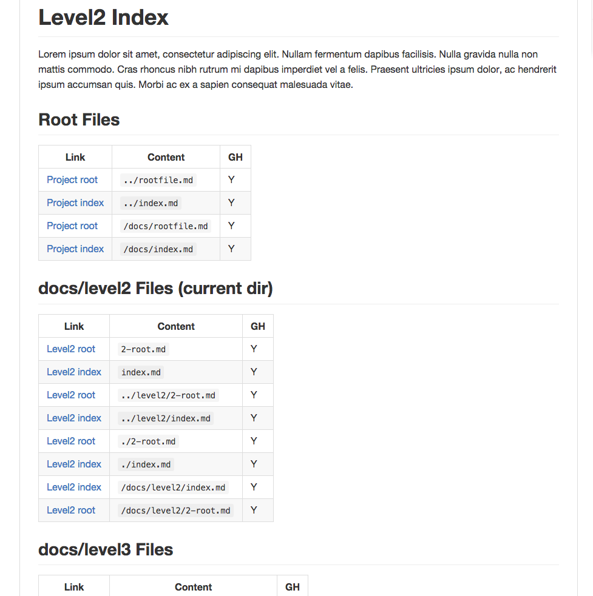

# About this project

The company servers both open-source and commercial documentation from the `docs.docker.com` site. This is our official site. We release frequently and the current site requires release of all the project documentation each time and project releases. 

Our documentation processes should consistently build and release good-quality documentation. Good-quality documentation should include links and images that resolve reliably.  

This project compares Markdown files in the GitHub repositories with the static HTML site generated by our static file generator. The goals of *this project* are to propose a means for creating Markdown that results in reliable resolution of links and images.

## How the test was run

Relative links were built at each page then tested for resolution in GitHub.  Then, the same pages were tested with the static site generator and the release scripts. A number of tests were run with different approaches to `sed` and `ssed` scripts.

## Conclusion

Full paths relative to the `docs` directory in both images and page references is the best option in Markdown.  

* cross reference link  `[Level2 root](/docs/level2/level3/3-root.md)`
* image paths ``

The `pros` of requiring this format:

* It works reliably for both images and page references in GitHub.
* It is simple to locate and transform with a `sed`.
* The transformed paths resolve reliably with the static file generator.
* It is easy to explain to users.
* It is easy for the human eye to detect as present.
* Moving the sourcefile does not break the paths in the file.

The `cons` of requiring this format:

* Contributors must limit themselves to full path names.
* Full pathnames are longer to type.

## Underlying technical drivers

To fully understand this project, you need to understand some technical drivers.

### Contributors

Contributors are a subset of our users base that visit or interact with our GitHub repositories. Contributors are an exclusive subset of our open source users. Commercial users do not have access to Docker's commercial repositories. 

Contributors want individual Markdown pages in the GitHub repo to work like HTML pages on a web server. Specifically, they want the links and the images to resolve.

This project should result in clear instructions for creating documentation cross-references and image paths that resolve in GitHub. Allow for compilation of documentation contributions in pull requests and report broken links or missing images as errors.

### Understand GitHub Link Support

GitHub [supports relative
links](https://help.github.com/articles/relative-links-in-readmes/). We tested
this and, in practice, found that at deeper levels the relative links seem to
break.  Not all relative links work consistently see the [Level 3
root](level2/level3/3-root.md) in comparison to the [Level 3
index](level2/level3/index.md) links.

In the `docs` directory of this project, are three levels of folders and files.  At each level is a file called `index.md` and a root file.  Each page is constructed with relative links to other files.  Then notation is made whether that link works in GitHub:

## How the build works

At run time, the build copies the source files from the `*projectname*/docs` directory into a `content/*projectname*` directory. This copy prevents naming collisions between Docker projects which may have files or folders with identical names.

Once the files are copied, a script runs several `seds` over the `.md` files looking for page cross reference paths and image paths.

* cross reference link  `[Level2 root](level2/level3/3-root.md)`
* image paths ``

The build adjusts the paths to make them relative to the `projectname` directory. After the adjustment, the Hugo generator runs and creates static HTML files.

<table>
<tr>
<td align="top">
<pre>
.
|-- Dockerfile
|-- Makefile
|-- index.md
|-- level2
|   |-- 2-root.md
|   |-- images
|   |   `-- baldwin.gif
|   |-- index.md
|   `-- level3
|       |-- 3-root.md
|       `-- index.md
|-- pre-process.sh
`-- rootfile.md
</pre>
</td>
<td align="top">
<pre>
.
|-- Dockerfile
|-- Makefile
|-- index.html
|-- index.xml
|-- level2
|   |-- 2-root
|   |   `-- index.html
|   |-- images
|   |   `-- baldwin.gif
|   |-- index.html
|   `-- level3
|       |-- 3-root
|       |   `-- index.html
|       `-- index.html
|-- pre-process.sh
`-- rootfile
    `-- index.html
</pre>
</td>
</tr>
</table>

Docker makes use of `index.md` filenames for product and section headings. A single project can have an `index.md` file at multiple directory levels. File generators handle files called `index.md` differently than other files. Files with the `index.md` name generate into the sourcefile's current directory. 

* https://github.com/docker/machine/tree/master/docs/index.md --> http://docs.docker.com/machine/ 
* https://github.com/docker/machine/tree/master/docs/reference/index.md --> http://docs.docker.com/machine/reference
* https://github.com/docker/machine/tree/master/docs/drivers/index.md --> http://docs.docker.com/machine/drivers/

Files with other names generate into subdirectories by their filename.

* https://github.com/docker/machine/tree/master/docs/install.md --> http://docs.docker.com/machine/install
* https://github.com/docker/machine/tree/master/docs/reference/restart.md --> http://docs.docker.com/machine/reference/restart
* https://github.com/docker/machine/tree/master/docs/drivers/aws.md --> http://docs.docker.com/machine/drivers/aws 

In GitHub, the `index.md` file and the other files reside in the same directory. This means, relative paths that work in GitHub don't work in the static files. Moreover, adjusting these files in a `sed` script requires treating an `index.md` file differently than other files.
